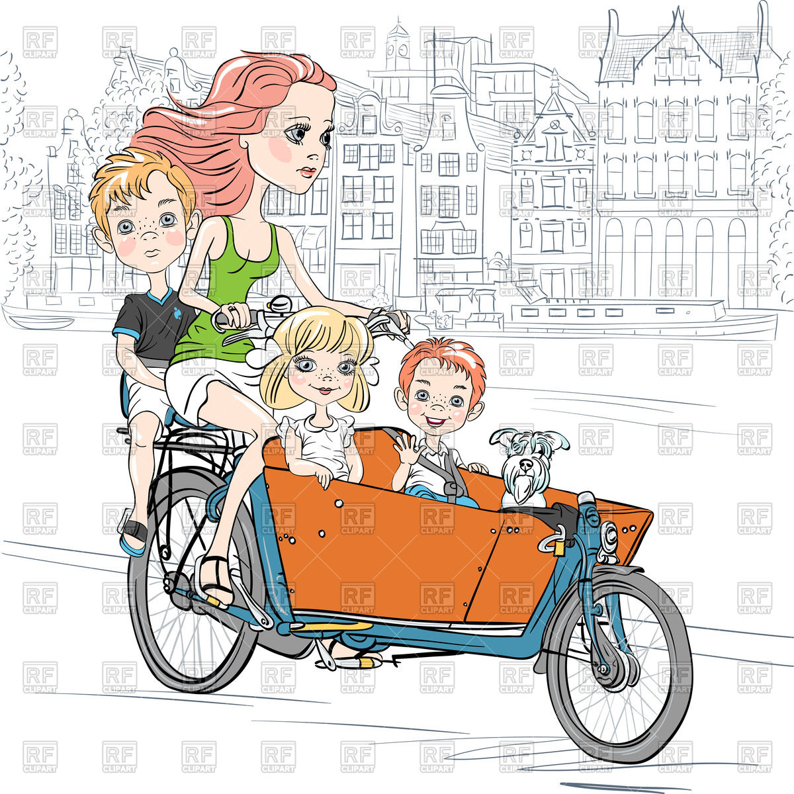

---
title       : Find My Perfect Car!
subtitle    : Taking frustration away from car shopping
author      : Abi
job         : 
framework   : io2012  # {io2012, html5slides, shower, dzslides, ...}
highlighter : highlight.js  # {highlight.js, prettify, highlight}
hitheme     : tomorrow      # 
widgets     : []            # {mathjax, quiz, bootstrap}
mode        : selfcontained # {standalone, draft}
knit        : slidify::knit2slides
logo        : car.png
github      :
        user: abhisheksinghcs
        repo: findmyperfectcar

--- &redline .custom

## Meet Sally and Harry

Sally and Harry both have similar but different needs! They both need a car but...
*** =left

### Sally needs to drive her kids to school, soccer, do groceries... she is a cost concious supermom!!

*** =right

### Harry loves to live life on the edge... he loves to push the limits... power and speed matters to him!!

--- &redline .custom

## ...Who are trying to choose a new car ...

But there are so many variations on every possible dimension. On top of that there are an infinite combinations of these.... So we developed <b>Find my perfect car!</b> application to make the process a little simpler.


### ...Because in reality you might really care for one or two parameters...
```{r, cache=TRUE}
data(mtcars)
ncars <- nrow(mtcars)

```

We have a hand picked collection of `r ncars` cars for you to pick based on:

> * The power you want - <b>Cylinders(Cyl)</b> and <b>Horsepower (HP)</b>
> * Primary purpose - may be you care about <b>Miles Per Gallon (mpg)</b>
> * Manufacturer - All of us love some cars over other so we provide an option for choosing the <b>brand</b> 

--- &redline .custom

## ..See it's that simple!

We have done the hardwork so you can focus on things you love whether it's driving little Suzy to soccer or enjoying the weekend on the race track!


So what are you waiting for let's help you find your<a href = "https://august.shinyapps.io/programmingAssignment"> Perfect car! </a>

--- &slide
<br>
<br>
<q><a href = "https://august.shinyapps.io/programmingAssignment">Find My Perfect Car! </a> a new way to shop!</q>
